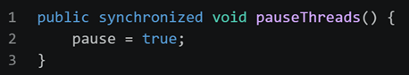
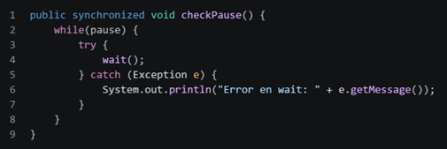
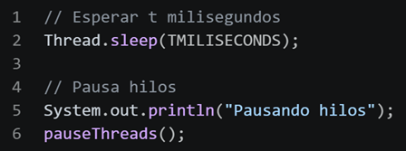
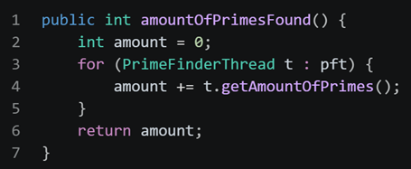
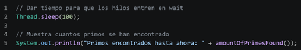
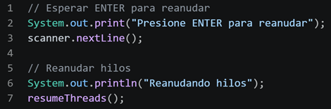
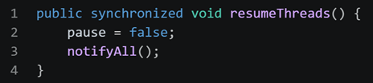
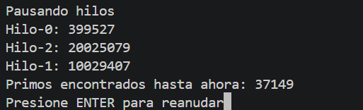
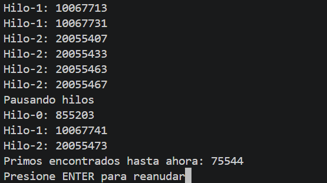

# Snake Race — ARSW Lab #2 (Java 21, Virtual Threads)

**Escuela Colombiana de Ingeniería – Arquitecturas de Software**  
Laboratorio de programación concurrente: condiciones de carrera, sincronización y colecciones seguras.

---

## Requisitos

- **JDK 21** (Temurin recomendado)
- **Maven 3.9+**
- SO: Windows, macOS o Linux

---

## Cómo ejecutar

```bash
mvn clean verify
mvn -q -DskipTests exec:java -Dsnakes=4
```

- `-Dsnakes=N` → inicia el juego con **N** serpientes (por defecto 2).
- **Controles**:
  - **Flechas**: serpiente **0** (Jugador 1).
  - **WASD**: serpiente **1** (si existe).
  - **Espacio** o botón **Action**: Pausar / Reanudar.

---

## Reglas del juego (resumen)

- **N serpientes** corren de forma autónoma (cada una en su propio hilo).
- **Ratones**: al comer uno, la serpiente **crece** y aparece un **nuevo obstáculo**.
- **Obstáculos**: si la cabeza entra en un obstáculo hay **rebote**.
- **Teletransportadores** (flechas rojas): entrar por uno te **saca por su par**.
- **Rayos (Turbo)**: al pisarlos, la serpiente obtiene **velocidad aumentada** temporal.
- Movimiento con **wrap-around** (el tablero “se repite” en los bordes).

---

## Arquitectura (carpetas)

```
co.eci.snake
├─ app/                 # Bootstrap de la aplicación (Main)
├─ core/                # Dominio: Board, Snake, Direction, Position
├─ core/engine/         # GameClock (ticks, Pausa/Reanudar)
├─ concurrency/         # SnakeRunner (lógica por serpiente con virtual threads)
└─ ui/legacy/           # UI estilo legado (Swing) con grilla y botón Action
```

---

# Actividades del laboratorio

## Parte I — (Calentamiento) `wait/notify` en un programa multi-hilo

1. `Toma el programa [PrimeFinder](https://github.com/ARSW-ECI/wait-notify-excercise).`

2. `Modifícalo para que cada _t_ milisegundos:`
   - Se **pausen** todos los hilos trabajadores.
   
        Cada t milisegundos (TMILISECONDS = 5000), el hilo Control cambia la bandera pause = true y llama a pauseThreads().

        

        Los hilos PrimeFinderThread, al ejecutar checkPause() en cada iteración, entran en espera:

        

        Código desde Control.run():

        

   - Se **muestre** cuántos números primos se han encontrado.

        Después de pausar los hilos, se calcula la suma de primos encontrados por cada hilo:

        

        En Control.run(), luego de la pausa:

        

   - El programa **espere ENTER** para **reanudar**.

        Tras mostrar el conteo, se espera a que el usuario presione ENTER y luego se reanudan los hilos:

        

        resumeThreads() cambia la bandera y despierta a todos los hilos que están en wait():

        

3. `La sincronización debe usar synchronized, wait(), notify() / notifyAll() sobre el mismo monitor (sin _busy-waiting_).`


    | Requisito | Implementación | Observaciones |
    |------------------|-------------------------------|----------------|
    | **Mismo monitor** | Todos los métodos sincronizados (`pauseThreads()`, `resumeThreads()`, `checkPause()`) usan `synchronized` sobre `this` (objeto `Control`). Los hilos trabajadores comparten la misma referencia `control`. | Fundamental para que `wait()` y `notifyAll()` operen sobre la misma cola de espera. |
    | **Sin busy-waiting** | Los hilos trabajadores llaman a `wait()` dentro de `checkPause()`, pasando al estado `WAITING` y liberando la CPU. No existen bucles activos que consuman ciclos de procesador. |  El programa es eficiente en el uso de CPU durante las pausas. |
    | **Uso de `wait()`** | Se invoca `wait()` dentro del bloque `synchronized` en `checkPause()`, liberando el monitor hasta que se reciba una notificación. |  Correctamente implementado dentro del bucle `while(pause)`. |
    | **Uso de `notifyAll()`** | `resumeThreads()` invoca `notifyAll()` después de establecer `pause = false`. | Se utiliza `notifyAll()` en lugar de `notify()` para despertar todos los hilos trabajadores. |


4. `Entrega en el reporte de laboratorio las observaciones y/o comentarios explicando tu diseño de sincronización (qué lock, qué condición, cómo evitas _lost wakeups_).`

    ### ¿Qué lock se utiliza?
    Lock = objeto Control (this). Todos los métodos sincronizados (pauseThreads(), resumeThreads(), checkPause()) usan el mismo monitor, compartido entre el hilo controlador y los trabajadores.

    ### ¿Qué condición se utiliza?


    **Condición = variable `volatile boolean pause`**:

    | Valor | Significado |
    |-------|-------------|
    | `pause = true` | Los hilos deben detenerse |
    | `pause = false` | Los hilos pueden ejecutar |

    ### ¿Cómo se evitan lost wakeups?

    **Dos mecanismos:**

    1. **`notifyAll()`** en lugar de `notify()` → despierta todos los hilos, no solo uno.

    2. **`while(pause)`** en lugar de `if(pause)` → al despertar, verifican la condición nuevamente.

5. `Prueba Fotografica`

    

    


