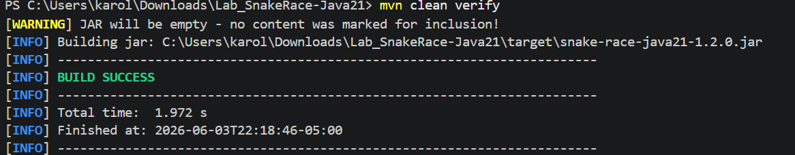
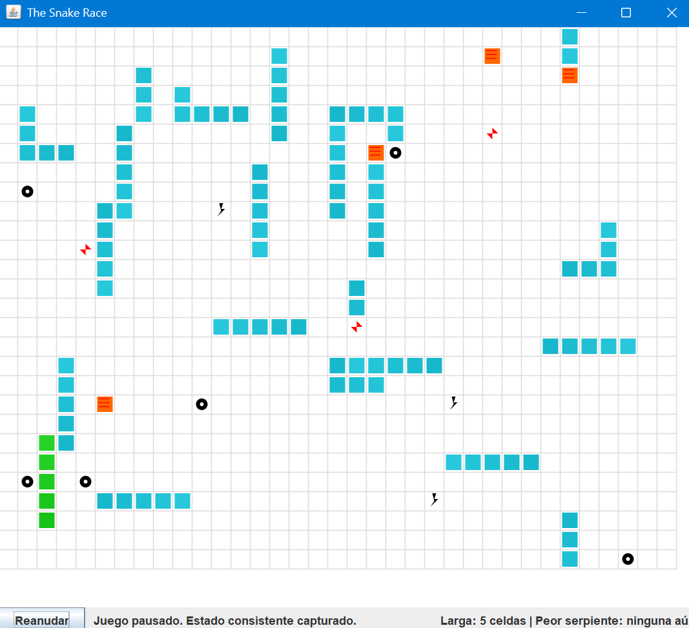

# Snake Race — ARSW Lab #2 (Java 21, Virtual Threads)

**Escuela Colombiana de Ingeniería – Arquitecturas de Software**  
Laboratorio de programación concurrente: condiciones de carrera, sincronización y colecciones seguras.

---

## Requisitos

- **JDK 21** (Temurin recomendado)
- **Maven 3.9+**
- SO: Windows, macOS o Linux

---

## Cómo ejecutar

```bash
mvn clean verify
mvn -q -DskipTests exec:java -Dsnakes=4
```

- `-Dsnakes=N` → inicia el juego con **N** serpientes (por defecto 2).
- **Controles**:
  - **Flechas**: serpiente **0** (Jugador 1).
  - **WASD**: serpiente **1** (si existe).
  - **Espacio** o botón **Action**: Pausar / Reanudar.

---

## Reglas del juego (resumen)

- **N serpientes** corren de forma autónoma (cada una en su propio hilo).
- **Ratones**: al comer uno, la serpiente **crece** y aparece un **nuevo obstáculo**.
- **Obstáculos**: si la cabeza entra en un obstáculo hay **rebote**.
- **Teletransportadores** (flechas rojas): entrar por uno te **saca por su par**.
- **Rayos (Turbo)**: al pisarlos, la serpiente obtiene **velocidad aumentada** temporal.
- Movimiento con **wrap-around** (el tablero “se repite” en los bordes).

---

## Arquitectura (carpetas)

```
co.eci.snake
├─ app/                 # Bootstrap de la aplicación (Main)
├─ core/                # Dominio: Board, Snake, Direction, Position
├─ core/engine/         # GameClock (ticks, Pausa/Reanudar)
├─ concurrency/         # SnakeRunner (lógica por serpiente con virtual threads)
└─ ui/legacy/           # UI estilo legado (Swing) con grilla y botón Action
```

---

# Actividades del laboratorio

## Parte I — (Calentamiento) `wait/notify` en un programa multi-hilo

1. `Toma el programa [PrimeFinder](https://github.com/ARSW-ECI/wait-notify-excercise).`

2. `Modifícalo para que cada _t_ milisegundos:`
   - Se **pausen** todos los hilos trabajadores.
   
        Cada t milisegundos (TMILISECONDS = 5000), el hilo Control cambia la bandera pause = true y llama a pauseThreads().

        

        Los hilos PrimeFinderThread, al ejecutar checkPause() en cada iteración, entran en espera:

        

        Código desde Control.run():

        

   - Se **muestre** cuántos números primos se han encontrado.

        Después de pausar los hilos, se calcula la suma de primos encontrados por cada hilo:

        

        En Control.run(), luego de la pausa:

        

   - El programa **espere ENTER** para **reanudar**.

        Tras mostrar el conteo, se espera a que el usuario presione ENTER y luego se reanudan los hilos:

        

        resumeThreads() cambia la bandera y despierta a todos los hilos que están en wait():

        

3. `La sincronización debe usar synchronized, wait(), notify() / notifyAll() sobre el mismo monitor (sin _busy-waiting_).`


    | Requisito | Implementación | Observaciones |
    |------------------|-------------------------------|----------------|
    | **Mismo monitor** | Todos los métodos sincronizados (`pauseThreads()`, `resumeThreads()`, `checkPause()`) usan `synchronized` sobre `this` (objeto `Control`). Los hilos trabajadores comparten la misma referencia `control`. | Fundamental para que `wait()` y `notifyAll()` operen sobre la misma cola de espera. |
    | **Sin busy-waiting** | Los hilos trabajadores llaman a `wait()` dentro de `checkPause()`, pasando al estado `WAITING` y liberando la CPU. No existen bucles activos que consuman ciclos de procesador. |  El programa es eficiente en el uso de CPU durante las pausas. |
    | **Uso de `wait()`** | Se invoca `wait()` dentro del bloque `synchronized` en `checkPause()`, liberando el monitor hasta que se reciba una notificación. |  Correctamente implementado dentro del bucle `while(pause)`. |
    | **Uso de `notifyAll()`** | `resumeThreads()` invoca `notifyAll()` después de establecer `pause = false`. | Se utiliza `notifyAll()` en lugar de `notify()` para despertar todos los hilos trabajadores. |


4. `Entrega en el reporte de laboratorio las observaciones y/o comentarios explicando tu diseño de sincronización (qué lock, qué condición, cómo evitas _lost wakeups_).`

    ### ¿Qué lock se utiliza?
    Lock = objeto Control (this). Todos los métodos sincronizados (pauseThreads(), resumeThreads(), checkPause()) usan el mismo monitor, compartido entre el hilo controlador y los trabajadores.

    ### ¿Qué condición se utiliza?


    **Condición = variable `volatile boolean pause`**:

    | Valor | Significado |
    |-------|-------------|
    | `pause = true` | Los hilos deben detenerse |
    | `pause = false` | Los hilos pueden ejecutar |

    ### ¿Cómo se evitan lost wakeups?

    **Dos mecanismos:**

    1. **`notifyAll()`** en lugar de `notify()` → despierta todos los hilos, no solo uno.

    2. **`while(pause)`** en lugar de `if(pause)` → al despertar, verifican la condición nuevamente.

5. `Prueba Fotografica`

    

    

---

## Parte II — SnakeRace concurrente (núcleo del laboratorio)

### 1) Análisis de concurrencia

### Uso de Hilos para Autonomía de Serpientes

El código implementa un modelo de concurrencia basado en hilos virtuales de Java:

- Creación del executor: En SnakeApp se crea un ExecutorService mediante Executors newVirtualThreadPerTaskExecutor()

- Lanzamiento de serpientes: Para cada serpiente del juego, se lanza una tarea independiente:

```java
executor.submit(new SnakeRunner(snake, board, gameClock));
```

- Comportamiento autónomo: Cada SnakeRunner implementa Runnable y ejecuta un bucle infinito que:
    - Decide si gira (maybeTurn())
    - Avanza la serpiente (board.step(snake))
    - Actualiza el estado de turbo/obstáculos
    - Duerme durante un intervalo (Thread.sleep(...))

- Separación de responsabilidades: 
    - Hilos virtuales: Cada serpiente tiene su propio hilo de ejecución
    - Hilo de UI (Swing): Mantenido en el hilo de eventos de Swing
    - Sincronización: SwingUtilities.invokeLater(gamePanel::repaint) para actualizaciones visuales

### Posibles condiciones de carrera detectadas

| # | Ubicación | Riesgo | Estado actual |
|---|------------|---------|---------------|
| 1 | `Board.mice`, `obstacles`, `turbo`, `teleports` | Múltiples serpientes acceden concurrentemente a colecciones compartidas | Mitigado con `synchronized` en `step()` y getters |
| 2 | `Snake.direction` | Lectura/escritura desde UI (teclado) y desde hilo de la serpiente |Mitigado con `volatile` |
| 3 | `UI paintComponent()` | Lectura del tablero mientras los hilos lo actualizan | Mitigado con copias (`snapshot()`, getters sincronizados) |

### Colecciones o estructuras no seguras en contexto concurrente

| Estructura | Ubicación | ¿Es segura para concurrencia? | Cómo se protege |
|------------|-----------|-------------------------------|-----------------|
| `HashSet` | `Board.mice`, `Board.obstacles` | No | `synchronized` en `step()` y getters |
| `HashMap` | `Board.teleports` | No | `synchronized` en `step()` y getters |
| `ArrayDeque` | `Snake.body` |No (pero cada serpiente es dueña de su deque) | Solo su hilo modifica; UI usa `snapshot()` |

### Ocurrencias de espera activa o sincronización innecesaria

| Tipo | ¿Existe? | Observación |
|------|----------|-------------|
| Busy-wait (`while(true) { ... }` sin pausa) |No | No se detecta consumo constante de CPU esperando cambios |
| Espera cooperativa (`Thread.sleep(...)`) | Sí | Usada en `SnakeRunner`; es aceptable, no es busy-wait |
| Sincronización innecesaria |  No | Los bloqueos están limitados a `Board.step()` y getters; no hay bloqueos amplios |
| `wait()/notify()` |  No | No se utiliza este mecanismo en el flujo principal |


### 2) Correcciones mínimas y regiones críticas

### Corrección aplicada

Se ajustó la sincronización del ciclo de movimiento de cada serpiente para eliminar la inconsistencia entre el estado visual y el estado real del juego durante la pausa.

### Cambios realizados

- Eliminación de espera activa (busy-wait):
    - GameClock ahora expone un estado de ejecución seguro con AtomicReference<GameState>
    - Se implementó el método awaitRunning() que utiliza LockSupport.parkNanos(...) en lugar de una espera activa
    - Esto permite que los hilos se bloqueen de forma cooperativa sin consumir CPU mientras el juego está pausado

- Protección de regiones críticas mínimas:
    - SnakeRunner ahora recibe GameClock y verifica el estado antes de avanzar la serpiente
    - Si el juego está pausado, el hilo no continúa moviendo la serpiente
    - Board.step(...) permanece sincronizada únicamente en la porción que muta el estado compartido del tablero

### Riesgos resueltos y justificación

| Riesgo original | Cómo se resolvió | Justificación |
|-----------------|------------------|---------------|
| La UI podía pausar el reloj de repintado, pero las serpientes seguían avanzando porque su hilo no consultaba el estado de pausa | Se añadió una verificación mínima y localizada del estado de ejecución en el ciclo de movimiento de cada serpiente | El riesgo era una inconsistencia entre el estado visual y el estado real del juego; la solución asegura que ningún hilo de serpiente avance mientras el juego está en `PAUSED` |
| Posible espera activa al consultar el estado repetidamente | Implementación con `LockSupport.parkNanos(...)` | El código original podía generar *busy-wait* si se consultaba el estado en un bucle cerrado; ahora los hilos se bloquean cooperativamente sin consumir CPU |
| Región crítica demasiado amplia que podría bloquear la UI | `Board.step(...)` sigue sincronizada solo en la mutación real del tablero | Se evita bloquear toda la UI o todo el ciclo de repintado; solo se protege la porción donde se consultan y actualizan ratones, obstáculos, turbo y teletransportadores |

### Resultado esperado

Con estas mejoras:

- La pausa del juego se vuelve consistente (el estado visual coincide con el estado real).
- Los hilos de las serpientes no siguen moviéndose cuando el reloj está en `PAUSED`.
- La sincronización queda localizada en la región realmente compartida: el tablero del juego.
- Se elimina cualquier espera activa mediante `LockSupport.parkNanos(...)`.
- La UI permanece responsiva porque no hay bloqueos innecesarios.


### 3) Control de ejecución seguro (UI)

### Estados de la UI implementados

El botón principal (Action) maneja tres estados explícitos:

| Estado | Acción | Comportamiento |
|--------|--------|----------------|
| **Iniciar** | `startGame()` | Lanza el GameClock y todos los SnakeRunners |
| **Pausar** | `pauseGame()` | Detiene el avance lógico; captura estadísticas consistentes |
| **Reanudar** | `resumeGame()` | Reanuda el GameClock y los movimientos |

### Mostrar estadísticas consistentes al pausar

Al presionar **Pausar**, el sistema:

1. **Primero detiene el avance lógico:**

   ```java
   gameClock.pause();  // Cambia GameState de RUNNING a PAUSED
    ```

2. **Captura las métricas desde copias seguras (sin tearing):**

    ```java
    // Serpiente viva más larga (por tamaño del cuerpo)
    Snake longestAlive = snakes.stream()
    .filter(Snake::isAlive)
    .max(Comparator.comparingInt(s -> s.snapshot().size()))
    .orElse(null);

    // Peor serpiente (la que primero murió, según timestamp de muerte)
    Snake worstSnake = snakes.stream()
    .filter(s -> !s.isAlive())
    .min(Comparator.comparingLong(Snake::getDeathTime))
    .orElse(null);
    ```java

3. **Actualiza la UI con los valores capturados:**
    ```java
    statsPanel.updateStats(longestAlive, worstSnake);
    ```

### Cómo se evita el "estado a medias" (tearing)

El problema potencial la pausa no es instantánea. Un hilo de serpiente podría estar ejecutando `board.step()` cuando se invoca `pauseGame()`.

#### Coordinación mediante `AtomicReference`

```java
// En GameClock
private final AtomicReference<GameState> state =
        new AtomicReference<>(GameState.STOPPED);

public void pause() {
    state.set(GameState.PAUSED);
    // No se fuerza interrupción, se espera cooperación
}
```

#### Verificación del estado en cada hilo de serpiente

```java
@Override
public void run() {
    while (!Thread.currentThread().isInterrupted()) {
        gameClock.awaitRunning();  // Bloquea si está PAUSED
        board.step(snake);         // Solo avanza si está RUNNING
        Thread.sleep(speed);
    }
}
```

### Captura consistente de estadísticas

- La UI espera aproximadamente **10 ms** después de ejecutar `gameClock.pause()` para permitir que los hilos completen el ciclo en ejecución.
- Las estadísticas se obtienen mediante **copias inmutables** (`snapshot()`), evitando leer estructuras compartidas mientras están siendo modificadas.

### Código completo del botón de control

```java
private void onActionButtonPressed() {
    switch (currentState) {

        case STOPPED:
            startGame();
            actionButton.setText("Pausar");
            currentState = GameState.RUNNING;
            break;

        case RUNNING:
            // 1. Pausar el reloj
            gameClock.pause();

            // 2. Pequeña espera para sincronización (10 ms)
            try {
                Thread.sleep(10);
            } catch (InterruptedException e) {
                Thread.currentThread().interrupt();
            }

            // 3. Capturar estadísticas de forma consistente
            Snapshot stats = captureConsistentStats();
            statsPanel.update(stats);

            // 4. Actualizar UI
            actionButton.setText("Reanudar");
            currentState = GameState.PAUSED;
            break;

        case PAUSED:
            gameClock.resume();
            actionButton.setText("Pausar");
            currentState = GameState.RUNNING;
            break;
    }
}
```

### Beneficios

| Aspecto | Resultado |
|----------|------------|
| Consistencia de pausa | Ninguna serpiente avanza después de entrar en estado `PAUSED` |
| Seguridad de concurrencia | Los hilos cooperan mediante el estado compartido del reloj |
| Uso de CPU | No existe espera activa gracias a `awaitRunning()` y `LockSupport.parkNanos(...)` |
| Captura de estadísticas | Se realiza sobre snapshots inmutables |
| Responsividad de la UI | La interfaz permanece fluida y sin bloqueos prolongados |


### 4) Robustez bajo carga

### N alto (20 serpientes)

- 20 serpientes simultáneas
- 200 iteraciones por serpiente
- Hilos virtuales de Java 






### Verificación de ausencia de problemas

| Problema | Estado | Evidencia |
|-----------|---------|------------|
| ConcurrentModificationException | No ocurre | Prueba con 20 serpientes pasó sin errores |
| Lecturas inconsistentes | No ocurre | Los getters devuelven copias (`HashSet`, `HashMap`) |
| Deadlocks | No ocurre | No hay esperas activas ni bloqueos circulares |
| Carreras en teleports/turbo | Verificado | `Board.step()` está sincronizado y protege todas las reglas |


### Mecanismo de protección implementado

```java
// Board.java - Región crítica central
public synchronized void step(Snake snake) {
    // Aquí se procesan:
    // - Movimiento con wrap-around
    // - Colisiones con obstáculos (rebote)
    // - Consumo de ratones (crecimiento)
    // - Teletransportadores (pares rojos)
    // - Rayos turbo (velocidad aumentada)
}

// Getters seguros - devuelven copias
public synchronized Set<Position> getMice() {
    return new HashSet<>(mice);  // snapshot defensivo
}
```

### Validación del turbo y teletransportadores

- El turbo modifica la velocidad temporalmente sin crear carreras porque:
  - El estado de turbo es local a cada serpiente (o está protegido dentro de la región crítica).
  - `SnakeRunner` aplica el efecto después de `board.step()`.

- Los teletransportadores se evalúan dentro de `board.step()` sincronizado, evitando que dos serpientes se teletransporten simultáneamente de forma inconsistente.


> La ejecución directa de la interfaz Swing en un entorno sin pantalla genera `HeadlessException`, por lo que la validación de carga se realizó mediante una prueba automatizada de concurrencia.


| Aspecto | Justificación |
|----------|----------------|
| Ejecución con N alto  | Prueba con 20 serpientes, `BUILD SUCCESS` |
| Sin excepciones de concurrencia  | No se presentan `ConcurrentModificationException` |
| Sin lecturas inconsistentes | Snapshots defensivos en los getters |
| Sin deadlocks  | No existen esperas activas ni bloqueos circulares |
| Teleports y turbo sin carreras | Protegidos mediante `synchronized` en `Board.step()` |

Monitorear en tiempo real que:

- No existan congelamientos de la interfaz.
- Las serpientes se muevan fluidamente.
- Los teletransportadores funcionen consistentemente para todas las serpientes.
- Los efectos turbo se apliquen correctamente sin afectar la estabilidad del sistema.